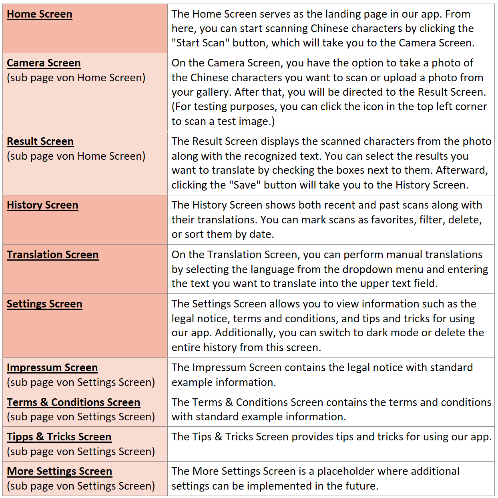
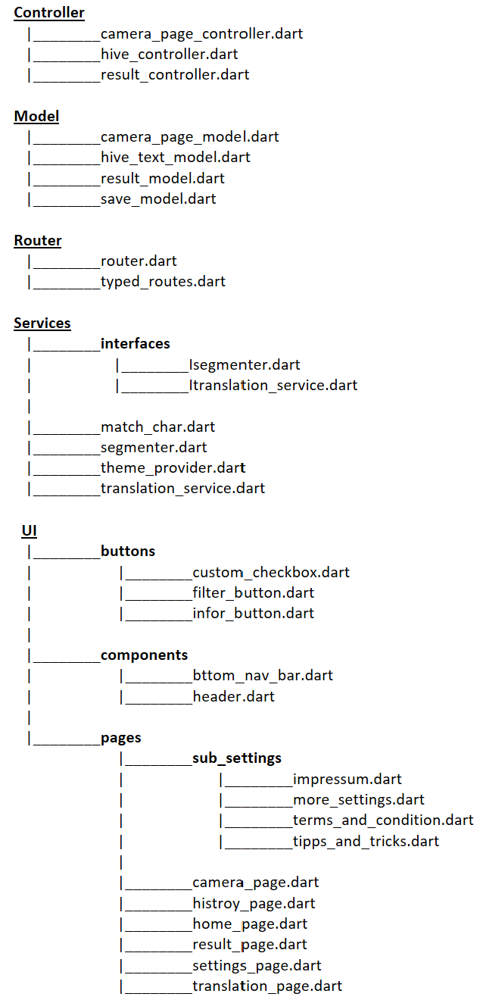
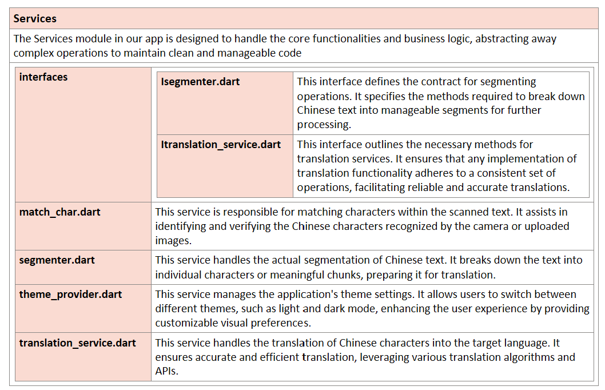
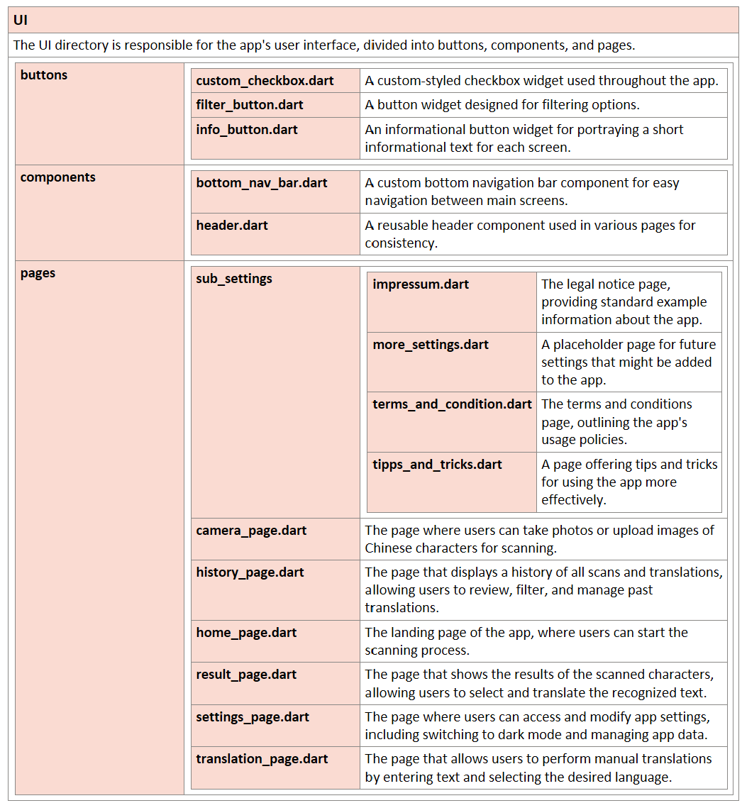

# ScriptSense 

## Table of Contents

1. [Abstract](#abstract)
2. [Detailed Description](#detailed-description)
3. [Short Description of each Screen](#short-description-of-screens)
4. [Architecture Description](#architecture-description)

## Abstract
Our app is designed to help users scan, translate, and manage Chinese characters with ease. Users can take photos or upload images of Chinese text, and the app will recognize and display the characters for selection and translation. The users's history keeps track of all scans and translations, offering easy sorting and filtering options. Additionally, users can perform manual translations by selecting the desired language and entering text directly.

## Detailed Description
Understanding and translating Chinese characters can be daunting, especially for non-native speakers. When confronted with Chinese characters in environments like China or Chinese supermarkets, German-speaking individuals often struggle due to their lack of proficiency in the Chinese language and the absence of an appropriate keyboard for input. Traditional methods involve cumbersome dictionaries or expensive translation services, leading to confusion and misunderstandings in daily life. Our app addresses these common challenges of translating and understanding Chinese characters, providing a user-friendly solution, by allowing users to quickly scan and translate Chinese text with their smartphone cameras. By addressing the specific needs of various personas, our app becomes an invaluable tool for anyone dealing with Chinese text, enhancing their learning, travel, and professional experiences.

### Target Persona
• **Students:** Language learners who need a reliable tool to assist with their studies. The app helps them recognize and understand characters in their textbooks, homework, or while practicing reading.
• **Travelers:** Tourists or business travelers who need to navigate through Chinese-speaking regions. The app assists in reading signs, menus, and other essential text, making their travel experience smoother.
• **Professionals:** Business people and academics who frequently deal with Chinese documents. The app provides a quick way to scan, translate, and manage Chinese text, aiding in their work and research.
• **Language Enthusiasts:** Individuals passionate about learning new languages and cultures. The app offers them a practical tool to explore and understand Chinese characters more deeply.

### Key Features
• **Scanning and Recognition:** Users can take photos or upload images of Chinese text, and the app will recognize and display the characters for translation.
• **Translation History:** A comprehensive history feature tracks all scans and translations, allowing users to sort and filter their past translations for easy reference.
• **Manual Translation:** Users can manually input text and select the desired language for translation, providing flexibility for translating specific phrases or sentences.
• **Settings and Customization:** The app includes various settings, such as switching to dark mode, managing user data, and accessing tips and tricks for optimal usage.

## Short Description of each Screen

## Architecture Description
<table>
  <tr>
    <td valign="top"></td>
    <td>
       
       
      
    </td>
  </tr>
</table>
